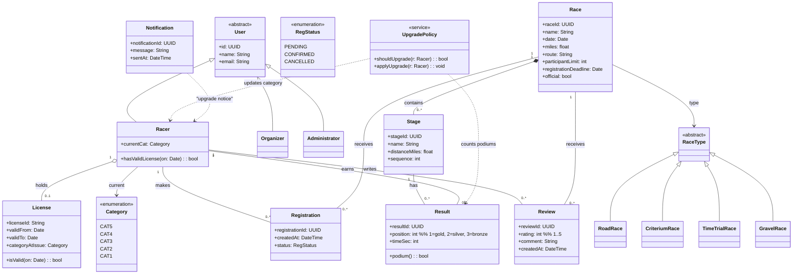

# Deliverable 1

### Team Name
KoelnerDomspatzen

### Team Members
Brynn Ayers, Nathan Jordan, Stephen Lee, Brandon Navarrete, Tamara Sopoyeva

## Team Reflection

### Current Progress
We have completed the high-level design for the bike racing registration system based on the provided requirements. This includes identifying the main classes, use cases, and design principles/constraints that will guide later iterations.

### Areas We Excelled
- We collaborated effectively to translate the requirements into a clear initial design. Our team successfully produced both the high-level class diagram and use case diagram (Aligned with principles such as SRP, OCP, KISS, and DRY)

- Communication
### Areas of Improvement
- We can improve by streamlining our collaboration tools and making sure everyone is comfortable using GitHub for version control. We also need to ensure that all group members stay aligned on design decisions as changes are made.

### Problems Faced
- Getting used to GitHub and collaboration systems such as Huddle in Slack. 
Some requirements in the assignments were not clearly defined, such as "stages".

### Changes to Next Iteration
We will get clarification on some expected functionality and requirements for the system and update our design if needed.

### Screencast URL
[Example Hyperlink (Replace Me)](ExampleURL)

## Individual Reflection

### Brynn Ayers
**Contributions:** Participated in a team call for a design review, functioning as the note-taker for the meeting. Offered input into the few revisions suggested by the team, what design tools to use, and helped clarify design elements by re-evaluation of the requirements document. Created both slack groups for team collaboration and communication.

**Reflection:** I’m happy with my communication and with the efforts I’ve made in the meeting, but I would like to be more involved in the design and development work in future cycles to make sure work is fairly allocated for everyone’s benefit. I’ve definitely had to work to familiarize myself with the tools and platforms and feel I will be more comfortable moving forward with them. Working through the design diagrams with the team was very valuable practice (and provided insight into why having multiple perspectives on one item can be invaluable), and I greatly appreciate the team I’ve been placed in. I look forward to delivering a quality product and learning a lot with this group!

### Nathan Jordan
**Contributions:** Listened during the group call to understnad the ongoing dsicussion about the class and use case diagrams. Researched the Race vs. Stage requirments afterward and shared clarifications with the group to help guide our design decisions. Opened a pull request to (1) move the type association from `Race -> RaceType` to `Stage -> RaceType` and (2) fix the upgrade flow direction to **Result -> UpgradePolicy -> Racer**. Posted a summary in Slack for review. Added my Individual Reflection to the deliverable.

**Reflection:** Clarifying the Stage vs. Race type helped me see how a tiny modeling change can remove ambiguity and future rework. Tying type to Stage keeps the design closer to the requirements, and flipping the upgrade flow makes the data dependency explicit (results drive upgrades). Next iteration I’ll participate more during meetings and continue documenting changes so they are visible, reviewed, and easy to trace.

### Stephen Lee
**Contributions:** Created Github Repo, Issues, Project. Created deliverable template. Generated original Class and Use Case diagrams via ChatGPT.

### Brandon Navarrete
**Contributions:** I contributed by suggesting adjustments to the class diagram, updating and refining diagrams, committing changes to the GitHub repository under the Deliverable 1 folder, and taking responsibility for recording the screencast.

**Reflection:** 
Working on this deliverable with a team showed me how project criteria can be interpreted in different ways but still lead to valid outcomes. This experience helped me appreciate the value of collaboration and discussion in aligning design decisions.

### Tamara Sopoyeva
**Contributions:** Participatd in team call where we reviewed templated diagram designs, agreed on needed revision, proposed action items and plan forward. Read over template deliverable to see if anything is missing or input is needed.

## Meeting Overview

### Summary of Meetings
1 meeting held via Slack voice call.

### Dates 
3 Sep 2025

### Duration
49 minutes

### Atendees
Brynn Ayers, Nathan Jordan, Brandon Navarrete, Tamara Sopoyeva

### Meeting Minutes
We looked at class diagram and revised it, was AI generated (GPT) (Stephen and Brandon contributed a ton with the foundation of the work we revised)
Brandon will post the video and screencap for the group.

Nathan needs added to the Git.

**Class Diagram Notes and Revisions:**
Removed Stage, as it seemed redundant upon re-evaluation of requirements. Deleted composition relationship from Race to Stage
Proposed changes to RaceType to eliminate enumeration (now or future) 
Proposed changing enums to be abstract classes

**Use Case Diagram Notes and Revisions:**
Notes: We're requesting clarification on the Race/Stage issue, because the instructions are unclear.
Possible revisions: Renaming manage stages to manage races to match removal of stage class (pending clarification)
Change wording of "Evaluate Category Upgrade" to reflect the organizer entering the results into the upgrade policy.

**Git Revision:** Core Classes in the written section need updated to reflect the actual class names in the diagram

## Design Principles  

We plan to apply the following design principles to guide the development of the bike racing registration system.  

*(Note: Not being stated below does not mean we will avoid other common strategies or principles; these are simply the primary ones we are highlighting for Deliverable 1.)*  

   ### Single Responsibility Principle (SRP)  
  Each class will have a single, clear purpose.  
  **Example:** The `License` class will only manage license attributes (ID, category, expiration) rather than race registration or payment details.  

   ### Open/Closed Principle (OCP)  
  The system should be open for extension but closed for modification.  
  **Example:** The `Race` class should support new race types (road, gravel, time trial, etc...) without requiring changes to its core design, allowing future extensions through subclasses or composition.  

   ### Don’t Repeat Yourself (DRY)  
  Shared logic will be centralized to prevent duplication.  
  **Example:** Login and account management will be handled in the base `User` class, avoiding repeated code in `Racer`, `Organizer`, and `Administrator`.  

   ### Keep It Simple (KISS)  
  The design will prioritize simplicity and avoid unnecessary complexity.  
  **Example:** Category upgrades will follow a direct rule (*five podium finishes = one category promotion*) rather than adding complicated point systems *(as stated in the requirements documentation).*  

## Design Constraints  

We have identified our constraints from two perspectives: **user/problem-side** and **technical/stack-side**.  

### User / Problem-Side Constraints  

- **Licensing Requirement** *(Requirements Document, p.1)*  
  Racers must purchase a valid license to register for official races.  
  Licenses are valid for one year and tied to the racer’s current category.  

- **Category System** *(Requirements Document, p.1–2)*  
  Racers are sorted into categories 5–1 (5 = beginner, 1 = elite).  
  Racers must only compete in races that match their current category.  
  Racers are promoted one category after five podium finishes (1st, 2nd, 3rd).  

- **Race Setup Rules** *(Requirements Document, p.2)*  
  Every race must offer all categories (5–1).  
  Each race has a date, type, distance, route, registration deadline, and participant cap.  
  Official races count toward category upgrades; unofficial races do not.  

- **Race History Persistence** *(Requirements Document, p.2)*  
  The system must keep a permanent record of races, results, and reviews.  
  Racer history must remain consistent across sessions (no data loss).  

---

### Technical / Stack-Side Constraints  

- **Programming Language: Java** *(Project Document, p.3 Deliverable 3/4)*  
  All implementation will be done in Java using object-oriented design.  

- **Deliverable Guidelines** *(Project Document, p.3–4)*  
  Early deliverables require UML diagrams and use case diagrams.  
  Future deliverables include architecture design, activity diagram, and UI sketches.  
  The final deliverable requires a functional system but does not require a full graphical user interface.  

- **Scalability & Extensibility** *(Project Document, learning objectives)*  
  The system should support design principles like SRP and OCP to allow new race types without redesign.  
  Each deliverable (1–4) expects maintaining and updating previous work.  

- **Data Management** *(Requirements Document, p.2)*  
  The system must persist race history, racer accounts, licenses, and results.  
  Persistence ensures that category upgrades and reviews are accurate over time.  

## Class Diagram
### Actors  

(From Requirements Document)  

- **Racer** – signs up, purchases license, registers for races, leaves reviews.  
- **Organizer** – creates races, manages stages, sets limits, enters results.  
- **Administrator** – manages accounts, licenses, and overall system settings.  

---

### Core Classes  
(Domain-focused, directly from requirements)  

- **User** (abstract base class for Racer, Organizer, Administrator)  
- **Racer**  
- **Organizer**  
- **Administrator**  
- **Race**  
- **License**  
- **Registration** (represents a Racer registering for a Race)  
- **Result** (captures race outcomes and podium information)  
- **Review** (Racer feedback about a Race)  

---

### Supporting System Classes  
(Implied, not explicitly in requirements but needed for real-world system design)  

- **AccountManager** (handles authentication and account lifecycle)  
- **PaymentProcessor** (handles credit card transactions for licenses)  
- **NotificationService** (notifies Racers of category upgrades or race information)  
- **DataRepository** (central persistence gateway for races, results, and users)  
- **UIController** (manages interaction between system logic and user interface)  

>**NOTE:** Original class diagram was generated by ChatGPT but edited to better suit our design principles. See Appendix reference 1 for the AI promt.

## Use Case Diagram

```mermaid
flowchart TB
  %% ===== External Actors =====
  Racer([Racer])
  Organizer([Organizer])
  Admin([Administrator])

  %% ===== System Boundary =====
  subgraph BRS[ Bike Racing Registration System ]
    direction TB

    %% Racer use cases
    subgraph RUC[Racer Use Cases]
      UC_SignUp([Sign up / Provide name & card])
      UC_BuyLicense([Purchase annual license])
      UC_RegisterOfficial([Register for official race])
      UC_RegisterUnofficial([Register for unofficial race])
      UC_ViewResults([View race history & results])
      UC_ReviewRace([Review race])
    end

    %% Organizer use cases
    subgraph OUC[Organizer Use Cases]
      UC_CreateRace([Create race])
      UC_ManageStages([Manage stages])
      UC_SetLimits([Set registration limits & last day])
      UC_PublishRace([Publish race])
      UC_EnterResults([Enter race results])
    end

    %% Admin use cases
    subgraph AUC[Admin Use Cases]
      UC_ManageUsers([Manage user accounts])
      UC_ManageLicenses([Manage licenses])
      UC_SystemSettings([Manage system settings])
    end

    %% Internal service: Upgrade Policy
    subgraph UPS[Upgrade Policy Service]
      UC_EvaluateUpgrade([Evaluate category upgrade])
      UC_NotifyUpgrade([Notify racer of category upgrade])
    end

    %% System/internal use case
    UC_VerifyLicense([Verify valid license & category])
  end

  %% ===== Associations =====
  Racer --- UC_SignUp
  Racer --- UC_BuyLicense
  Racer --- UC_RegisterOfficial
  Racer --- UC_RegisterUnofficial
  Racer --- UC_ViewResults
  Racer --- UC_ReviewRace

  Organizer --- UC_CreateRace
  Organizer --- UC_ManageStages
  Organizer --- UC_SetLimits
  Organizer --- UC_PublishRace
  Organizer --- UC_EnterResults

  Admin --- UC_ManageUsers
  Admin --- UC_ManageLicenses
  Admin --- UC_SystemSettings

  %% ===== Include / Extend flows =====
  UC_RegisterOfficial -. "<<include>><br/>Verify license & category" .-> UC_VerifyLicense
  UC_CreateRace -. "<<include>>" .-> UC_ManageStages
  UC_CreateRace -. "<<include>>" .-> UC_SetLimits
  UC_CreateRace -. "<<extend>><br/>Publish when ready" .-> UC_PublishRace

  %% Organizer enters results, Upgrade Policy takes over
  UC_EnterResults -. "<<include>><br/>Provide podium data" .-> UC_EvaluateUpgrade
  UC_EvaluateUpgrade -. "<<include>><br/>Notify racer" .-> UC_NotifyUpgrade

  UC_RegisterUnofficial -. "<<extend>><br/>May skip license" .-> UC_VerifyLicense
```

>**NOTE:** Original use case diagram was generated by ChatGPT but edited to better suit our design principles. See Appendix reference 2 for the AI promt.
  
## Review Section
>**Feedback:** N/A

>**Changes Made:** N/A

## Appendix

1. 
2. 
