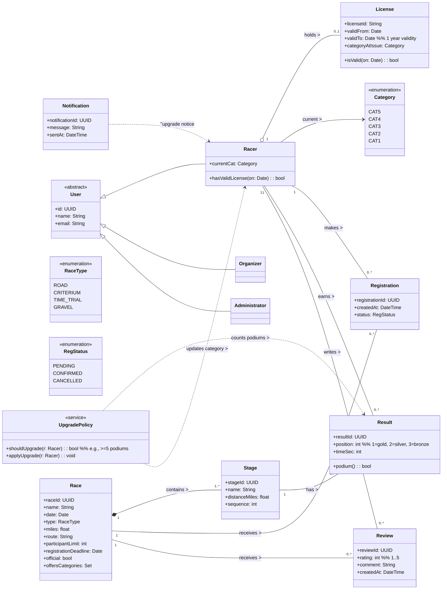
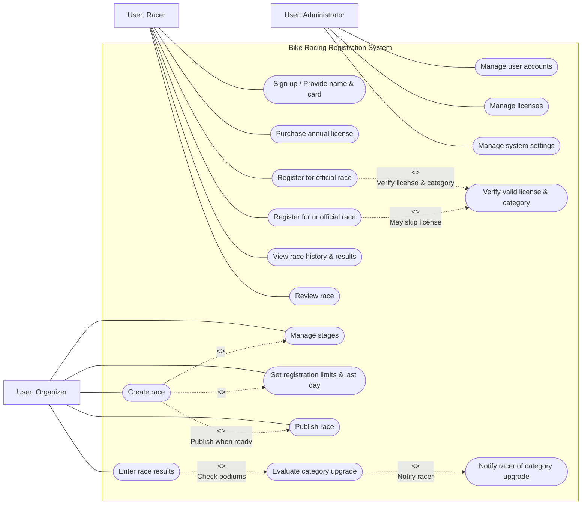

# Deliverable 1
**Team Name:** KoelnerDomspatzen

**Team Members:** Brynn Ayers, Nathan Jordan, Stephen Lee, Brandon Navarrete, Tamara Sopoyeva

## Team Reflection
**Current Progress:**

**Areas We Excelled:**

**Areas of Improvement:**

**Problems Faced:**

**Changes to Next Iteration:**

**Screencast URL:** [Example Hyperlink (Replace Me)](ExampleURL)

## Individual Reflection
**Name:** Brynn Ayers

**Contributions:**

**Name:** Nathan Jordan

**Contributions:** 

**Name:** Stephen Lee

**Contributions:** Created Github Repo, Issues, Project. Created deliverable template.

**Name:** Brandon Navarrete

**Contributions:** 

**Name:** Tamara Sopoyeva

**Contributions:** 

## Meeting Overview

**Meeting Summary:**

**Dates:** 

**Duration:**

**Atendees:**

## Design

**Design Principles:**

**Design Constraints:**

**Class Diagram**

**Example diagram generated by ChatGPT. Replace with diagram agreed upon by group**

**Use-Case Diagram**

**Example diagram generated by ChatGPT. Replace with diagram agreed upon by group**

  
## Review Section
N/A
