# Deliverable 2

### Team Name
KoelnerDomspatzen

### Team Members
Brynn Ayers, Nathan Jordan, Stephen Lee, Brandon Navarrete, Tamara Sopoyeva

## Team Reflection

### Current Progress
- Deliverable 2 is complete and ready to transition to next phase.

### Areas We Excelled
- Team Responsiveness

### Areas of Improvement
- We need to improve efficiency in coordinating diagramming tools so diagrams are consistent in style. (minimal rework was suggested and completed)
- Some members are still gaining confidence with GitHub workflows, so commits and versioning could be smoother.  

### Problems Faced
- Not enough time was established for this second round of cordination 

### Changes to Next Iteration
- Standardize diagramming conventions so future deliverables (especially sequence diagrams) have a consistent look.

### Screencast URL
[Youtube Link to KoelnerDomspatzen's Deliverable Two (Update Me)](UpdateMe)

## Individual Reflection

>### Brynn Ayers
>**Contributions:** Helped schedule today’s meeting as well as the meeting at 4pm CST 9/22. Took notes for the meeting and added the meeting details to the document. Helped perform a team review of the deliverable.
>
>**Reflection:** While the project is going well, I am not totally satisfied with my performance this week, as I let the due date sneak up on me. The communication between our team was great and helped make up for the deficit in our planning, but this is my primary focus for improvement moving into the next deliverable. I’m very satisfied with the results of our work and with the team. I look forward to a clear delegation of responsibilities for the upcoming deliverable to feel like I’m contributing more to the team.

>### Nathan Jordan
>**Contributions:** Reviewed the draft deliverable for consistency with project requirements and met with the group to discuss reverting changes that did not align with the assignemnt.
>
>**Reflection:** This assignment showed me the importance of group review and communication to keep our work aligned. For the next deliverable, I plan to be more involved in drafting content as well as reviewing.

>### Stephen Lee
>**Contributions:** Created Deliverable 2 template, updated Review section to include Instructor and Peer feedback, reorganized Deliverable 1 section to be consistant with the Project document, simplified the Use Case diagram, created initial Activity diagram,
> updated class diagram
>
>**Reflection:**

>### Brandon Navarrete  
>**Contributions:** Created the Architecture Diagram, created gui ( inspired by Stephen) initiated the Activity Diagram, and made enhancements and edits in GitHub.   
>
>**Reflection:** Overall, the project is progressing well without major concerns. Team members have been very detail-oriented, identifying even small issues, which has been valuable for improving the >quality of our work.  

>### Tamara Sopoyeva
>**Contributions:** Reviwed updates and new items (artichectual design, activity diagram, UI sketch). Commumicated with the teammates and provided feedback on chosen design and execution of it. Ensured the deliverable meets expectation per the instructions in assigment. 
>
>**Reflection:** The team interaction is great, everyone communicates repsesctuflly but focuses on procuing results. Team members are good at communicating progress and challenges and listening and disussing everyone input. The project is progressing good and the team is improving on communicating and time management. 

## Meeting Overview

### Summary of Meetings:

>**Meeting 9/15:** Detailed notes are available in the general channel of Slack for our group.
We addressed several concerns brought up by members of the team, primarily that the Use case diagram uploaded was for a different assignment. Our current solution at the time of the meeting was revision pending an update by Stephen. All other portions of work reviewed passed review and are ready for delivery when the individual portions are completed. We also planned our next meeting to ensure we are on top of the deliverables that are upcoming.

### Dates 

>**Team Meeting Dates:** 9/15 @ 3:25PM

### Duration

>**Team Meeting Duration:** 28 minutes.

### Attendees
>**Team Meeting Attendees:** Tamara S, Nathan J, Brynn A, Brandon N

### Meeting Minutes
>**Detailed Minutes are available in the Gen channel.**

## Update to Deliverable 1

### Class Diagram
#### Actors  

(From Requirements Document)  

- **Racer** – signs up, purchases license, registers for races, leaves reviews.  
- **Organizer** – creates races, manages stages, sets limits, enters results.  
- **Administrator** – manages accounts, licenses, and overall system settings.  

---

#### Core Classes  
(Domain-focused, directly from requirements)  

- **User** (abstract base class for Racer, Organizer, Administrator)  
- **Racer**  
- **Organizer**  
- **Administrator**  
- **Race**  
- **License**  
- **Registration** (represents a Racer registering for a Race)  
- **Result** (captures race outcomes and podium information)  
- **Review** (Racer feedback about a Race)  

---

#### Supporting System Classes  
(Implied, not explicitly in requirements but needed for real-world system design)  

- **AccountManager** (handles authentication and account lifecycle)  
- **PaymentProcessor** (handles credit card transactions for licenses)  
- **NotificationService** (notifies Racers of category upgrades or race information)  
- **DataRepository** (central persistence gateway for races, results, and users)  
- **UIController** (manages interaction between system logic and user interface)  

|:--:|
| **Figure 1.** Class Diagram f/Bike Racing Registration System |

>**NOTE:** Original class diagram was generated by ChatGPT but edited to better suit our design principles. See Appendix reference 1 for the AI promt.

## Use Case Diagram

```mermaid
flowchart TB
  %% ===== External Actors =====
  Racer([Racer])
  Organizer([Organizer])
  Admin([Administrator])

  %% ===== System Boundary =====
  subgraph BRS[ Bike Racing Registration System ]
    direction TB

    %% Racer use cases
    subgraph RUC[Racer Use Cases]
      UC_SignUp([Sign up / Provide name & card])
      UC_BuyLicense([Purchase annual license])
      UC_RegisterOfficial([Register for official race])
      UC_RegisterUnofficial([Register for unofficial race])
      UC_ViewResults([View race history & results])
      UC_ReviewRace([Review race])
    end

    %% Organizer use cases
    subgraph OUC[Organizer Use Cases]
      UC_CreateRace([Create race])
      UC_ManageStages([Manage stages])
      UC_SetLimits([Set registration limits & last day])
      UC_PublishRace([Publish race])
      UC_EnterResults([Enter race results])
    end

    %% Admin use cases
    subgraph AUC[Admin Use Cases]
      UC_ManageUsers([Manage user accounts])
      UC_ManageLicenses([Manage licenses])
      UC_SystemSettings([Manage system settings])
    end

    %% Internal service: Upgrade Policy
    subgraph UPS[Upgrade Policy Service]
      UC_EvaluateUpgrade([Evaluate category upgrade])
      UC_NotifyUpgrade([Notify racer of category upgrade])
    end

    %% System/internal use case
    UC_VerifyLicense([Verify valid license & category])
  end

  %% ===== Associations =====
  Racer --- UC_SignUp
  Racer --- UC_BuyLicense
  Racer --- UC_RegisterOfficial
  Racer --- UC_RegisterUnofficial
  Racer --- UC_ViewResults
  Racer --- UC_ReviewRace

  Organizer --- UC_CreateRace
  Organizer --- UC_ManageStages
  Organizer --- UC_SetLimits
  Organizer --- UC_PublishRace
  Organizer --- UC_EnterResults

  Admin --- UC_ManageUsers
  Admin --- UC_ManageLicenses
  Admin --- UC_SystemSettings

  %% ===== Include / Extend flows =====
  UC_RegisterOfficial -. "<<include>><br/>Verify license & category" .-> UC_VerifyLicense
  UC_CreateRace -. "<<include>>" .-> UC_ManageStages
  UC_CreateRace -. "<<include>>" .-> UC_SetLimits
  UC_CreateRace -. "<<extend>><br/>Publish when ready" .-> UC_PublishRace

  %% Organizer enters results, Upgrade Policy takes over
  UC_EnterResults -. "<<include>><br/>Provide podium data" .-> UC_EvaluateUpgrade
  UC_EvaluateUpgrade -. "<<include>><br/>Notify racer" .-> UC_NotifyUpgrade

  UC_RegisterUnofficial -. "<<extend>><br/>May skip license" .-> UC_VerifyLicense
```

>**NOTE:** Original use case diagram was generated by ChatGPT but edited to better suit our design principles. See Appendix reference 2 for the AI promt.

### Design Principles  

We plan to apply the following design principles to guide the development of the bike racing registration system.  

*(Note: Not being stated below does not mean we will avoid other common strategies or principles; these are simply the primary ones we are highlighting for Deliverable 1.)*  

   #### Single Responsibility Principle (SRP)  
  Each class will have a single, clear purpose.  
  **Example:** The `License` class will only manage license attributes (ID, category, expiration) rather than race registration or payment details.  

   #### Open/Closed Principle (OCP)  
  The system should be open for extension but closed for modification.  
  **Example:** The `Race` class should support new race types (road, gravel, time trial, etc...) without requiring changes to its core design, allowing future extensions through subclasses or composition.  

   #### Don’t Repeat Yourself (DRY)  
  Shared logic will be centralized to prevent duplication.  
  **Example:** Login and account management will be handled in the base `User` class, avoiding repeated code in `Racer`, `Organizer`, and `Administrator`.  

   #### Keep It Simple (KISS)  
  The design will prioritize simplicity and avoid unnecessary complexity.  
  **Example:** Category upgrades will follow a direct rule (*five podium finishes = one category promotion*) rather than adding complicated point systems *(as stated in the requirements documentation).*  

### Design Constraints  

We have identified our constraints from two perspectives: **user/problem-side** and **technical/stack-side**.  

#### User / Problem-Side Constraints  

- **Licensing Requirement** *(Requirements Document, p.1)*  
  Racers must purchase a valid license to register for official races.  
  Licenses are valid for one year and tied to the racer’s current category.  

- **Category System** *(Requirements Document, p.1–2)*  
  Racers are sorted into categories 5–1 (5 = beginner, 1 = elite).  
  Racers must only compete in races that match their current category.  
  Racers are promoted one category after five podium finishes (1st, 2nd, 3rd).  

- **Race Setup Rules** *(Requirements Document, p.2)*  
  Every race must offer all categories (5–1).  
  Each race has a date, type, distance, route, registration deadline, and participant cap.  
  Official races count toward category upgrades; unofficial races do not.  

- **Race History Persistence** *(Requirements Document, p.2)*  
  The system must keep a permanent record of races, results, and reviews.  
  Racer history must remain consistent across sessions (no data loss).  

---

#### Technical / Stack-Side Constraints  

- **Programming Language: Java** *(Project Document, p.3 Deliverable 3/4)*  
  All implementation will be done in Java using object-oriented design.  

- **Deliverable Guidelines** *(Project Document, p.3–4)*  
  Early deliverables require UML diagrams and use case diagrams.  
  Future deliverables include architecture design, activity diagram, and UI sketches.  
  The final deliverable requires a functional system but does not require a full graphical user interface.  

- **Scalability & Extensibility** *(Project Document, learning objectives)*  
  The system should support design principles like SRP and OCP to allow new race types without redesign.  
  Each deliverable (1–4) expects maintaining and updating previous work.  

- **Data Management** *(Requirements Document, p.2)*  
  The system must persist race history, racer accounts, licenses, and results.  
  Persistence ensures that category upgrades and reviews are accurate over time.  

## Architectural Design

|:--:|
| **Figure 3.** Layered Architecture for Bike Racing Registration System |

## Presentation Layer (CLOSED)
**Nodes:** Racer, Organizer, Administrator (actors) and UIController  

**Responsibility:** Provides the user interface for all actors to interact with the system. Captures input such as race registration, entering results, and managing licenses, then forwards requests to the Business Layer.  

**Closed because:** It only communicates with the Business Layer. Preventing direct access to Services or Persistence ensures all interactions follow defined workflows.  

---

## Business Layer (CLOSED)
**Nodes:** Race, Registration, License, Result, Review, UpgradePolicy  

**Responsibility:** Encapsulates the core domain logic including race management, registration validation, license checks, result recording, category upgrades, and reviews. Ensures rules such as racers must hold a valid license or five podium finishes equal a promotion.  

**Closed because:** All business rules must be executed here before calling Services or Persistence. This enforces Single Responsibility and avoids bypassing business validation.  

---

## Services Layer (OPEN)
**Nodes:** AccountManager, NotificationService, PaymentProcessor  

**Responsibility:** Provides reusable shared services across the system. Handles authentication, notifications such as upgrade emails, and payments for licenses.  

**Open because:** Multiple layers may need to use services directly. For example, the Business Layer calls PaymentProcessor for registrations, while Presentation could directly access NotificationService in future extensions. Marking this layer open supports extensibility without requiring deep changes to other layers which aligns with OCP.  

---

## Persistence Layer (CLOSED)
**Node:** DataRepository  

**Responsibility:** Manages all data persistence operations by translating business objects into queries and ensuring reliable storage and retrieval. Provides a single entry point to the database, keeping storage logic consistent.  

**Closed because:** Only the Business Layer and Services Layer can call into it. Presentation cannot access the database directly. This avoids data corruption and enforces encapsulation.  

---

## Database Layer (CLOSED)
**Node:** Database (Users, Races, Licenses, Results, Reviews)  

**Responsibility:** Physical storage of all system entities. Ensures long-term persistence of race history, licenses, results, and reviews.  

**Closed because:** It is strictly internal and only the Persistence Layer can access it. Direct access from upper layers would break data integrity and bypass validation.  

## Activity Diagram

|:--:|
| **Figure 4.** Activity Diagram for `Enter Race Results`|

## UI Sketch

To complement the Activity Diagram, we created simple UI sketches showing how the workflow is experienced by different roles in the system. These sketches illustrate the **Organizer (Owner) view** for recording results and the **Racer view** for receiving notifications after category evaluation.  

### Owner View
The Owner (Organizer) is responsible for recording race results. Figure 3 shows the **Owner View**, where the organizer selects a race, enters a racer’s ID, and records their podium position. Once submitted, the system stores the results and determines whether the race is official. If it is, the upgrade policy service is triggered automatically.  

|:--:|
| **Figure 5.** Owner View - Organizer inputting race information and results.|
---

### Racer View
The Racer interacts with the system primarily by registering for races and receiving updates. Figure 4 shows the **Racer View**, where the racer receives a notification that their category has been upgraded after achieving five podium finishes in official races. This notification ensures racers are aware of their current category standing and any changes made by the upgrade policy.  

|:--:|
| **Figure 6.** Racer View – Racer receiving a notification of category upgrade.  |

---
## Review Section

**Instructor Feedback** 
- The instructor would like to be updated on our progress streamlining our collaboration tools (i.e. GitHub)
- Including contributions and reflections in the individual feedback section was a positive choice
- GitHub while primarily used for coding, was a good choice for team collaboration
- Good choice in design principles
- The Design Constraints section should be more focused on security, reliability etc.
- Our document was not in the order specified by the Project document
- Our Class diagram is hard to read, recommends cleaning it up and avoiding crossing lines
- Our Class diagram included a class without any relation
- Notes declairing AI usage was good
- Our Use Case diagram is overly detailed for a high level diagram, recommends simplifying
- Would like more details on the changes made to the AI generated diagrams

**Peer Feedback** 
- Expanding upon OCP and DRY principles would be benificial, specifically adding examples of how they could be applied
- Make relationships between supporting classes more explicit
- Diagram images are too small and hard to read
- Strong foundation
  
**Changes Made**
- Reorganized Deliverable 1 section to better allign with the Project Document
- Simplified the Use Case diagram
- Edited Class Diagram layout f/readability and changed from embedded code to png
- Added missing relationship to RegStatus class

## Appendix

1. 
