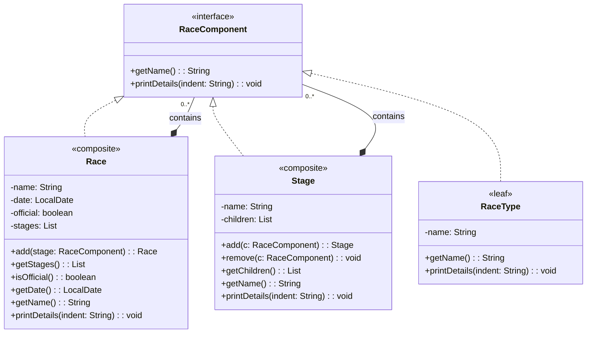
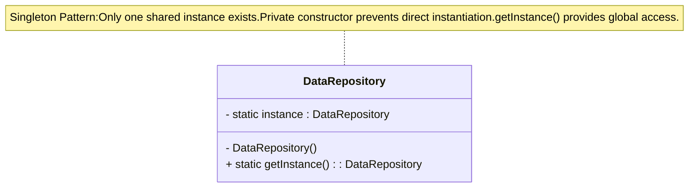

# Deliverable 4

### Team Name
KoelnerDomspatzen

### Team Members
Brynn Ayers, Nathan Jordan, Stephen Lee, Brandon Navarrete, Tamara Sopoyeva

## Team Reflection

### Current Progress
- Team currently meets the criteria for deliverable 4
- CLI demo for `Activity Diagram` using team designated Singelton and Composite Pattern exist and compiles.
- Design Patterns have respective class diagrams

### Areas We Excelled
- Communication
- Maintaining progress above deadlines.
- Making sure all the deliverable requirement are accounted for

### Areas of Improvement
- Coordination from previous Deliverable


### Problems Faced
- No *Signifcant* problems noticed in Deliverable 4
- Minor adjustment to src directory structure (Tidying Up)
  
### Changes to Next Iteration
<span style="color: green;">**NOTE: Project Complete as of 10/10/2025**</span>
  
### Screencast URL
[Youtube Link to KoelnerDomspatzen's Deliverable four]()

## Individual Reflection

>### Brynn Ayers
>**Contributions:** 
>
>**Reflection:** 

>### Nathan Jordan
>**Contributions:** I created the Composite pattern class diagram that aligned to our code: RaceComponent (interface), Race/Stage (composites), and RaceType (leaf).
>

>### Stephen Lee
>**Contributions:** Uploaded instructor/peer feedback, simplified use case diagram, updated activity diagram, added URL for class diagram
>
>**Reflection:**

>### Brandon Navarrete  
>**Contributions:** Built final CLI Demonstration for `Activity Diagram` using team designated Singelton and Composite Pattern. Also updated document with Singleton Design Class.
>


>### Tamara Sopoyeva
>**Contributions:**
>
>**Reflection:**

---

## Meeting Overview

>**6 Oct 2025**
>
>- **Team Meeting Duration:** 23 minutes
>- **Team Meeting Attendees:** Brynn Ayers, Nathan Jordan, Brandon Navarrete, Tamara Sopoyeva, Stephen Lee
>- **Meeting Minutes:** Detailed Minutes are available in the Gen channel.

---

## Update to Deliverable 2

### Class Diagram
#### Actors  

(From Requirements Document)  

- **Racer** – signs up, purchases license, registers for races, leaves reviews.  
- **Organizer** – creates races, manages stages, sets limits, enters results.  
- **Administrator** – manages accounts, licenses, and overall system settings.  
---

#### Core Classes  
(Domain-focused, directly from requirements)  

- **User** (abstract base class for Racer, Organizer, Administrator)  
- **Racer**  
- **Organizer**  
- **Administrator**  
- **Race**  
- **License**  
- **Registration** (represents a Racer registering for a Race)  
- **Result** (captures race outcomes and podium information)  
- **Review** (Racer feedback about a Race)  

---

#### Supporting System Classes  
(Implied, not explicitly in requirements but needed for real-world system design)  

- **AccountManager** (handles authentication and account lifecycle)  
- **PaymentProcessor** (handles credit card transactions for licenses)  
- **NotificationService** (notifies Racers of category upgrades or race information)  
- **DataRepository** (central persistence gateway for races, results, and users)  
- **UIController** (manages interaction between system logic and user interface)  


|:--:|
| **Figure 1.** Class Diagram f/Bike Racing Registration System |

[**CLICK HERE TO VIEW CLASS DIAGRAM**](https://github.com/SLee-842/SER315/blob/main/resources/images/Class%20Diagram.png)

>**NOTE:** Original class diagram was generated by ChatGPT but edited to better suit our design principles. See Appendix reference 1 for the AI promt.

## Use Case Diagram


|:--:|
| **Figure 2.** Use Case Diagram f/Bike Racing Registration System |


### Design Principles  

We plan to apply the following design principles to guide the development of the bike racing registration system.  

*(Note: Not being stated below does not mean we will avoid other common strategies or principles; these are simply the primary ones we are highlighting for Deliverable 1.)*  

   #### Single Responsibility Principle (SRP)  
  Each class will have a single, clear purpose.  
  **Example:** The `License` class will only manage license attributes (ID, category, expiration) rather than race registration or payment details.  

   #### Open/Closed Principle (OCP)  
  The system should be open for extension but closed for modification.  
  **Example:** The `Race` class should support new race types (road, gravel, time trial, etc...) without requiring changes to its core design, allowing future extensions through subclasses or composition.  

   #### Don’t Repeat Yourself (DRY)  
  Shared logic will be centralized to prevent duplication.  
  **Example:** Login and account management will be handled in the base `User` class, avoiding repeated code in `Racer`, `Organizer`, and `Administrator`.  

   #### Keep It Simple (KISS)  
  The design will prioritize simplicity and avoid unnecessary complexity.  
  **Example:** Category upgrades will follow a direct rule (*five podium finishes = one category promotion*) rather than adding complicated point systems *(as stated in the requirements documentation).*  

### Design Constraints  

We have identified our constraints from two perspectives: **user/problem-side** and **technical/stack-side**.  

#### User / Problem-Side Constraints  

- **Licensing Requirement** *(Requirements Document, p.1)*  
  Racers must purchase a valid license to register for official races.  
  Licenses are valid for one year and tied to the racer’s current category.  

- **Category System** *(Requirements Document, p.1–2)*  
  Racers are sorted into categories 5–1 (5 = beginner, 1 = elite).  
  Racers must only compete in races that match their current category.  
  Racers are promoted one category after five podium finishes (1st, 2nd, 3rd).  

- **Race Setup Rules** *(Requirements Document, p.2)*  
  Every race must offer all categories (5–1).  
  Each race has a date, type, distance, route, registration deadline, and participant cap.  
  Official races count toward category upgrades; unofficial races do not.  

- **Race History Persistence** *(Requirements Document, p.2)*  
  The system must keep a permanent record of races, results, and reviews.  
  Racer history must remain consistent across sessions (no data loss).

- **System Security and Reliability**
  Although system security is not explicitly a listed as a requirement, our system stores user information and processes license purchases, thus necessitating the protection of system and user records.
  Likewise admin's will have the ability to edit user accounts and system settings. It's imperative that we keep these privledges gaurded from user's not explicitly designated as admins.
  For these reasons, users must be required provide a validated username and password before interacting with the system.
---

#### Technical / Stack-Side Constraints  

- **Programming Language: Java** *(Project Document, p.3 Deliverable 3/4)*  
  All implementation will be done in Java using object-oriented design.  


- **Deliverable Guidelines** *(Project Document, p.3–4)*  
  Early deliverables require UML diagrams and use case diagrams.  
  Future deliverables include architecture design, activity diagram, and UI sketches.  
  The final deliverable requires a functional system but does not require a full graphical user interface.  


- **Scalability & Extensibility** *(Project Document, learning objectives)*  
  The system should support design principles like SRP and OCP to allow new race types without redesign.  
  Each deliverable (1–4) expects maintaining and updating previous work.  


- **Data Management** *(Requirements Document, p.2)*  
  The system must persist race history, racer accounts, licenses, and results.  
  Persistence ensures that category upgrades and reviews are accurate over time.  

## Architectural Design
The Architectural design chosen is 'Layered'. We feel that this will be suffice for the size and depth of this project.
.png)
|:--:|
| **Figure 3.** Layered Architecture for Bike Racing Registration System |


## Presentation Layer (<span style="color:red">CLOSED</span>)
**Nodes:** Racer, Organizer, Administrator (actors) and UIController  

**Responsibility:** Provides the user interface for all actors to interact with the system. Captures input such as race registration, entering results, and managing licenses, then forwards requests to the Business Layer.  

**Closed because:** It only communicates with the Business Layer. Preventing direct access to Services or Persistence ensures all interactions follow defined workflows.  

---

## Business Layer (<span style="color:red">CLOSED</span>)
**Nodes:** Race, Registration, License, Result, Review, UpgradePolicy  

**Responsibility:** Encapsulates the core domain logic including race management, registration validation, license checks, result recording, category upgrades, and reviews. Ensures rules such as racers must hold a valid license or five podium finishes equal a promotion.  

**Closed because:** All business rules must be executed here before calling Services or Persistence. This enforces Single Responsibility and avoids bypassing business validation.  

---

## Services Layer (<span style="color:green">OPEN</span>)
**Nodes:** AccountManager, NotificationService, PaymentProcessor  

**Responsibility:** Provides reusable shared services across the system. Handles authentication, notifications such as upgrade emails, and payments for licenses.  

**Open because:** Multiple layers may need to use services directly. For example, the Business Layer calls PaymentProcessor for registrations, while Presentation could directly access NotificationService in future extensions. Marking this layer open supports extensibility without requiring deep changes to other layers which aligns with OCP.  

---

## Persistence Layer (<span style="color:red">CLOSED</span>)
**Node:** DataRepository  

**Responsibility:** Manages all data persistence operations by translating business objects into queries and ensuring reliable storage and retrieval. Provides a single entry point to the database, keeping storage logic consistent.  

**Closed because:** Only the Business Layer and Services Layer can call into it. Presentation cannot access the database directly. This avoids data corruption and enforces encapsulation.  

---

## Database Layer (<span style="color:red">CLOSED</span>)
**Node:** Database (Users, Races, Licenses, Results, Reviews)  

**Responsibility:** Physical storage of all system entities. Ensures long-term persistence of race history, licenses, results, and reviews.  

**Closed because:** It is strictly internal and only the Persistence Layer can access it. Direct access from upper layers would break data integrity and bypass validation.  

## Activity Diagram


|:--:|
| **Figure 4.** Activity Diagram for `Enter Race Results`|

## Enhancements on UI Sketches  

### Login / Signup View
The Login / Signup View provides a simple interface for users to access the Bike Racing Registration System. Figure 5 shows the Login / Signup View, where a user can either enter existing credentials to log in or create a new account through the signup option. Once authenticated, the system verifies their role (Racer, Organizer, or Administrator) and grants access to the appropriate functionality.


|:--:|
| **Figure 5.** User prompted to login in or to sign up,|
---

### Owner View
The Owner (Organizer) is responsible for recording race results. Figure 6 shows the **Owner View**, where the organizer selects a race, enters a racer’s ID, and records their podium position. Once submitted, the system stores the results and determines whether the race is official. If it is, the upgrade policy service is triggered automatically.  


|:--:|
| **Figure 6.** Organizer inputting race information and results.|
---

### Racer View
The Racer interacts with the system primarily by registering for races and receiving updates. Figure 7 shows the **Racer View**, where the racer receives a notification that their category has been upgraded after achieving five podium finishes in official races. This notification ensures racers are aware of their current category standing and any changes made by the upgrade policy.  

|:--:|
| **Figure 7.** Racer View – Racer receiving a notification of category upgrade.  |

---

- **Owner View:** Highlights race selection and podium input fields to emphasize organizer workflow. Owner can choose to manually input race results or upload race results via csv.


|:--:|
| **Figure 8.** Owner View - Owner can manually edit or upload race results|


|:--:|
| **Figure 9.** Owner View - Upload race results selected|

[**CLICK HERE FOR MORE VIEWS**](https://github.com/SLee-842/SER315/tree/main/resources/images)

---

## Design Patterns Chosen  

### 1. Composite ~~and~~ ~~Observer~~ Pattern  

**Composite Implementation:**  
- Represents a `Race` composed of multiple `Stages`.
- Provides a uniform way to handle both single stages and full races.
- Supports operations such as displaying results or details without changin client code.

**Test Result:**  Race with multiple stages printed all stage details in one call, verifying the composite worked correctly.

~~**Observer Implementation:**~~
~~- Implemented on the Race class to notify observers when race data changes.~~
~~- Decouples race logic from display and notification functionality.~~
~~- Allows multiple observers of different types to subscribe and unsubscribe dynamically.~~

~~**Test Result:** Observers received updates when attached, and unsubscribed observers correctly stopped receiving notifications.~~

**Code Snippet (GitHub Link):**
[View Composite](https://github.com/SLee-842/SER315/tree/main/src/Composite)


**Pattern Class Diagram:**


---

### 2. Singleton Pattern  

**Implementation:**  
- Applied to `RaceRepository` to enforce a single access point for persistent storage of racers, races, registrations, and results.  
- Ensures all parts of the system (Racer, Organizer, Administrator) interact with the same repository instance.  
- Prevents data inconsistency that could arise if multiple repository objects existed.  
- Simplifies synchronization since any update made through one reference is immediately visible system-wide.  

* Illustration Table:**  

| Singleton        | Responsibility                                     | Benefit                                                                 |  
|------------------|---------------------------------------------------|-------------------------------------------------------------------------|  
| `DataRepository` | Centralized data access for racers, races, results | Guarantees integrity, avoids conflicting writes, and ensures consistency |  

**Code Snippet (GitHub Link):**  
[View DataRepository Singleton Implementation](https://github.com/SLee-842/SER315/blob/main/src/Singleton/DataRepository.java)  


**Pattern Class Diagram:**



**Unit Test Output:**  
```
=== RaceRepository Singleton Test Harness ===

Test 1: Verify repo1 and repo2 are the same Singleton instance...
PASS: Both references point to the same instance.

Test 2: Add a racer through repo1 and confirm repo2 can see it...
PASS: Racer info is consistent across Singleton references.

Test 3: Update racer info using repo2 and confirm repo1 sees the change...
PASS: Updated racer info is synchronized across Singleton references.

Test 4: Add a race result with repo1 and verify with repo2...
PASS: Race result consistent across Singleton references.
```


---
## Review Section

### Delivierable 1 Feedback
**Instructor Feedback** 
- The instructor would like to be updated on our progress streamlining our collaboration tools (i.e. GitHub)
- Including contributions and reflections in the individual feedback section was a positive choice
- GitHub while primarily used for coding, was a good choice for team collaboration
- Good choice in design principles
- The Design Constraints section should be more focused on security, reliability etc.
- Our document was not in the order specified by the Project document
- Our Class diagram is hard to read, recommends cleaning it up and avoiding crossing lines
- Our Class diagram included a class without any relation
- Notes declairing AI usage was good
- Our Use Case diagram is overly detailed for a high level diagram, recommends simplifying
- Would like more details on the changes made to the AI generated diagrams

**Peer Feedback** 
- Expanding upon OCP and DRY principles would be benificial, specifically adding examples of how they could be applied
- Make relationships between supporting classes more explicit
- Diagram images are too small and hard to read
- Strong foundation
  
**Changes Made**
- Reorganized Deliverable 1 section to better allign with the Project Document
- Simplified the Use Case diagram
- Edited Class Diagram layout f/readability and changed from embedded code to png
- Added missing relationship to RegStatus class

### Delivierable 2 Feedback
**Instructor Feedback** 
- More insight into our Current Progress
- More details regarding Problems Faced
- Video should give more insight into Design Decisions
- Individual Reflections are well organized
- More than one meeting per development cycle is reccomended
- Include RegStatus Enum multiplicity in the class diagram
- The class diagram while not incorrect is overly detailed for a high level diagram
- Add user passwords to class diagram
- Race Types and Results were represented well in the class diagram
- The use case diagram was delivered as mermaid code rather than an actual diagram
- The instructor liked our OCP example
- Design constraints should include security, reliability, etc.
- The system architecture is depicted in a way that isn't clear.
- Rename layers based on functionality and include respective classes
- Activity diagram seems small and should include error cases
- Manage Results Gui seems like it could be tedious, recommends adding file upload functionality
- Did not see changes to Design Constraints

  
**Changes Made**
- Replaced mermaid code f/use case diagram with actual use case diagram
- Updated RegStatus multiplicity in class diagram
- Added password variable to User class in class diagram
- Redesigned Manage Results Gui to include file upload funtionality
- Added security/reliability requirement to design constraints 
- Replaced Architecture Diagram with revised version
- Added more details to the problems faced, design decisions, and current progress

### Delivierable 3 Feedback
**Instructor Feedback** 
- The use case diagram resembles a flow chart
- The use case diagram could be depicted at higher level, showing only major function groups
- The activity diagram works but seems too simple


**Peer Feedback** 
- The class diagram is hard to read
- Typo in Figure 8 description
- More comments should be made throughout our source code and each class file should include a description
- The signleton pattern was a good choice for the repository, but should include proper safety handling to ensure data integrity in a threaded environment
- User classes should be created without the builder pattern as the pattern may be too complex for our desired application
- RaceType classes may be better suited as an enum as race type seems to be more of a lable than a functioning class
- Document was well organized
- Design patterns were clearly showcased in Github but not included in the deliverable document per the grading rubric
- Activity diagram is lacking error cases

  
**Changes Made**
- Typo in Figure 8 description corrected
- Simplified use case diagram per instructor feedback
- Builder pattern was dropped after considering user feedback
- Updated activity diagram
- Added URL for class diagram to aid in viewing


## Appendix

1. 
